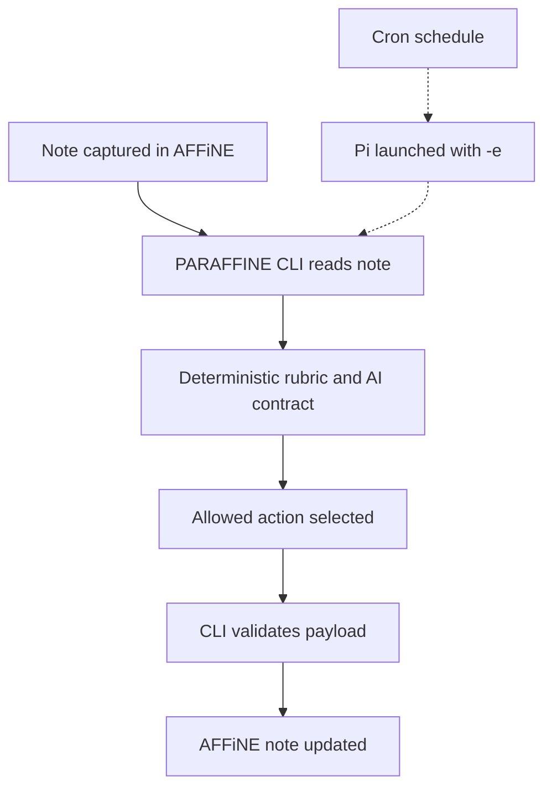

# PARAFFINE Architecture

## Reference Index

- [README.md](../README.md)
- [AGENTS.md](../AGENTS.md)
- [AI curation contract](paraffine-ai-curation-contract.md)
- [Implementation checklist](00-IMPLEMENTATION-CHECKLIST.md)

## Overview

PARAFFINE is an external workflow layer around AFFiNE. AFFiNE remains the
durable note store, while PARAFFINE decides how notes are captured, classified,
refined, retained, archived, and retrieved.

The Sprint 2 addition is the AI curation layer. It does not replace the PARA
method. It adds a constrained reasoning step that can recommend and apply
allowed maintenance actions.

## System Boundaries

| Layer | Responsibility | Not Responsible For |
|------|----------------|---------------------|
| AFFiNE | Durable storage and editing surface | Deciding curation policy or maintenance logic |
| PARAFFINE CLI | Workflow execution, validation, note mutation, deterministic fallback | Being the system of record |
| AI action contract | Limits model decisions to safe allowed actions | Direct storage or scheduling |
| Pi extension | Runtime bridge when launched with `-e` | Owning the note model |
| Cron | Scheduled invocation | Deciding note content on its own |

## Core Flow

## Karpathy Wiki Pattern Fit

The Karpathy-style wiki pattern belongs in refinement, not in classification.

- PARA answers where the note belongs.
- The AI contract answers what maintenance action is safe.
- Wiki-style compilation answers how rough notes become reusable knowledge.

That means:

- active project notes stay project notes while they support active execution
- completed project notes with durable lessons can be refined into resources
- completed project notes without reusable value should be archived
- areas remain ongoing responsibility material, not just old projects

## Contract References

The AI maintenance contract is defined in
[paraffine-ai-curation-contract.md](paraffine-ai-curation-contract.md).

That contract owns:

- allowed action names
- required payload fields
- action-specific validation rules
- decision rubric
- deterministic fallback behavior

This architecture doc keeps only the higher-level system boundary so later Pi
runtime and cron work can reference one stable contract.
