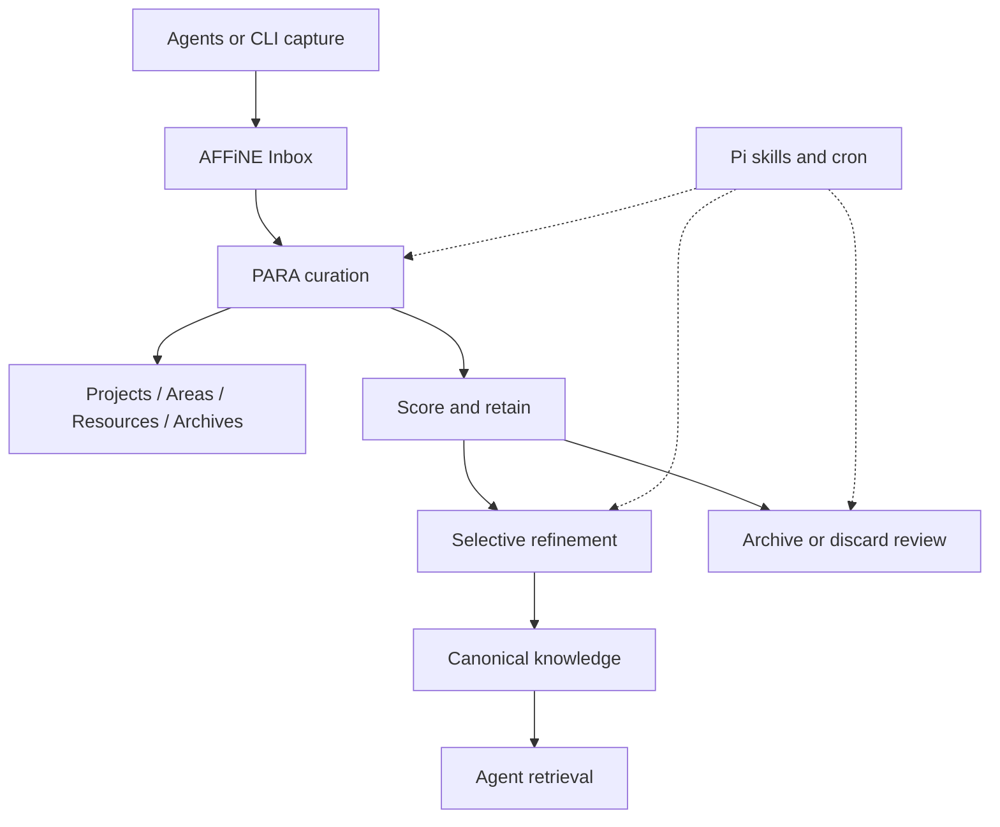

# PARAFFINE Architecture

## Reference Index

- [README.md](../README.md)
- [AGENTS.md](../AGENTS.md)
- [Implementation checklist](00-IMPLEMENTATION-CHECKLIST.md)

## Standards Gap

- No existing pattern yet defines the PARAFFINE note lifecycle, scoring model, or scheduled curation workflow.
- No repo-local adapter pattern exists yet for the AFFiNE write path in this external workflow layer.
- No background scheduling convention exists yet for Pi or cron-driven refinement and archive review.

## 1. Overview

PARAFFINE is an external workflow layer that sits around AFFiNE and uses the PARA method to organize notes by actionability. AFFiNE stores the notes, while PARAFFINE decides how they should be captured, curated, refined, retained, and retrieved.

The MVP does not require a Community Edition fork. The first release should prove that the workflow can work as a separate layer that keeps AFFiNE as the durable source of truth.

## 2. MVP Workflow

The first-cut workflow is intentionally small:

1. Agents or CLIs capture raw notes into an AFFiNE inbox.
2. A curation pass classifies notes into `Projects`, `Areas`, `Resources`, or `Archives`.
3. A refinement pass selectively rewrites only the notes that justify durable synthesis.
4. A review pass moves stale or low-value notes into explicit archive or discard states.
5. Retrieval surfaces only curated or canonical material back to agents.

## 3. System Boundaries

| Layer | Responsibility | Not Responsible For |
|------|----------------|---------------------|
| AFFiNE | Durable storage, editing, and retrieval surface | Curation policy or scheduled maintenance logic |
| PARAFFINE external workflow | Inbox routing, PARA placement, lifecycle decisions, selective refinement | Replacing AFFiNE as the store of record |
| Pi extensions / cron | Triggering scheduled passes and AI-assisted reasoning hooks | Owning the note model itself |
| Future AFFiNE CE fork | Optional deeper integration after the external workflow proves out | Phase 1 delivery |

The MVP should keep a single shared PARA model. It should not split software, business, and personal into separate systems unless scale proves that the shared model is failing.

## 4. Note Lifecycle Model

The high-level lifecycle is:

`captured -> inbox -> curated -> refined -> archived / discarded`

Recommended metadata fields for later implementation:

- `status`
- `kind`
- `domain`
- `confidence`
- `complexity`
- `relevance`
- `last_reviewed_at`
- `review_due_at`

This model keeps archive and discard decisions explicit. Discarded notes should remain auditable so the system remembers that a curation decision was made.

## 5. Phased Execution

### Phase 1: Repository Bootstrap

- Root docs explain the project, attribution, and working assumptions.
- The architecture doc becomes the repo-owned reference for the MVP.
- The checklist records the Sprint 1 issue tree.

### Phase 2: Lifecycle and Intake

- Define the note schema and lifecycle states.
- Build the AFFiNE inbox adapter and intake contract.

### Phase 3: Curation and Refinement

- Implement PARA classification and note scoring.
- Add selective refinement and archive/discard review.

### Phase 4: Retrieval and Scheduling

- Expose the curated knowledge for agent retrieval.
- Run the workflow on a repeatable schedule through Pi or cron.

### Phase 5: Optional AFFiNE Community Edition Integration

- Only after the external workflow is stable should the team consider moving behavior into a PARAFFINE-flavored AFFiNE Community Edition fork.

## 6. Open Questions

- What thresholds should trigger refinement, archive, or discard?
- Which metadata fields should be required at capture time versus added during curation?
- Should the first AI-assisted pass be optional or always on?
- What is the minimum acceptable retrieval contract for agents?

These questions are intentionally deferred to later tasks so the repository can stay focused on the bootstrap boundary.
