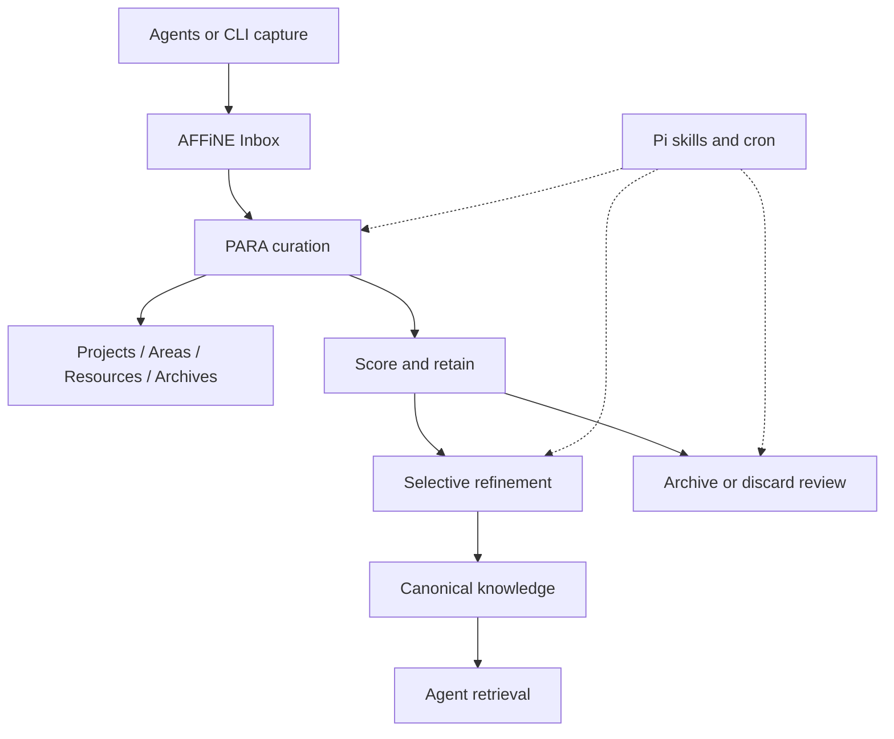

# PARAFFINE Architecture

## Reference Index

- [README.md](../README.md)
- [AGENTS.md](../AGENTS.md)
- [Implementation checklist](00-IMPLEMENTATION-CHECKLIST.md)
- [Note lifecycle spec](paraffine-note-lifecycle.md)

## Standards Gap

- The detailed PARAFFINE note lifecycle, scoring model, and review cadence are defined in [paraffine-note-lifecycle.md](paraffine-note-lifecycle.md).
- A repo-local AFFiNE CLI surface now exists in `scripts/paraffine-affine-inbox.js` for inbox capture, note reads, note updates, and PARA curation.
- No background scheduling convention exists yet for Pi or cron-driven refinement and archive review.

## 1. Overview

PARAFFINE is an external workflow layer that sits around AFFiNE and uses the PARA method to organize notes by actionability. AFFiNE stores the notes, while PARAFFINE decides how they should be captured, curated, refined, retained, and retrieved.

The MVP does not require a Community Edition fork. The first release should prove that the workflow can work as a separate layer that keeps AFFiNE as the durable source of truth.

## 2. MVP Workflow

The first-cut workflow is intentionally small:

1. Agents or CLIs capture raw notes into an AFFiNE inbox.
2. A curation pass classifies notes into `Projects`, `Areas`, `Resources`, or `Archives`.
3. A refinement pass selectively rewrites only the notes that justify durable synthesis.
4. A review pass moves stale or low-value notes into explicit archive or discard states.
5. Retrieval surfaces only curated or canonical material back to agents.

## 3. System Boundaries

| Layer | Responsibility | Not Responsible For |
|------|----------------|---------------------|
| AFFiNE | Durable storage, editing, and retrieval surface | Curation policy or scheduled maintenance logic |
| PARAFFINE external workflow | Inbox routing, PARA placement, lifecycle decisions, selective refinement | Replacing AFFiNE as the store of record |
| Pi extensions / cron | Triggering scheduled passes and AI-assisted reasoning hooks | Owning the note model itself |
| Future AFFiNE CE fork | Optional deeper integration after the external workflow proves out | Phase 1 delivery |

The MVP should keep a single shared PARA model. It should not split software, business, and personal into separate systems unless scale proves that the shared model is failing.

## Inbox Surface Assumption

The AFFiNE sidebar currently exposes `Inbox`, `Projects`, `Areas`, `Resources`, and `Archive` as organize folders, while the writable doc API still exposes a separate `PARA` doc tree.

That means the inbox adapter must:

- treat the doc API as the writable source of record
- resolve the `Inbox` organize folder separately
- create writable docs for inbox captures
- link those docs into the `Inbox` folder instead of assuming `Inbox` is itself a writable doc

The adapter should tolerate naming drift between the organize tree (`Archive`) and the doc tree (`Archives`) and document that difference instead of trying to rename live workspace structures during the MVP.

## 4. Note Lifecycle Reference

The durable note lifecycle, scoring model, capture-time versus curation-time metadata, and review cadence live in [paraffine-note-lifecycle.md](paraffine-note-lifecycle.md).

At the architecture level, the lifecycle stays intentionally simple:

`captured -> inbox -> curated -> refined -> canonical -> archived / discarded`

This doc only keeps the high-level flow and the phase boundary. The dedicated lifecycle spec owns the detailed state contract so downstream tasks can extend it without re-planning.

This model keeps archive and discard decisions explicit. Discarded notes should remain auditable so the system remembers that a curation decision was made.

The current policy baseline is:

- scoring uses both numeric values and qualitative bands
- the MVP tracks five dimensions: `confidence`, `complexity`, `relevance`, `duplication`, and `freshness`
- shared thresholds apply across those dimensions:
  - `low = 0-39`
  - `medium = 40-69`
  - `high = 70-100`
- capture requires `raw_text`, `source`, `captured_at`, `domain_hint`, and `kind_hint`
- canonicalization is aggressive when duplication is high, but only when confidence is not low
- archived notes may be reviewed automatically, but discarded notes return only through manual reopen

## 5. Phased Execution

### Phase 1: Repository Bootstrap

- Root docs explain the project, attribution, and working assumptions.
- The architecture doc becomes the repo-owned reference for the MVP.
- The checklist records the Sprint 1 issue tree.

### Phase 2: Lifecycle and Intake

- Define the note schema and lifecycle states.
- Build the AFFiNE inbox adapter and intake contract.

### Phase 3: Curation and Refinement

- Implement PARA classification and note scoring.
- Add selective refinement and archive/discard review.

### Phase 4: Retrieval and Scheduling

- Expose the curated knowledge for agent retrieval.
- Run the workflow on a repeatable schedule through Pi or cron.

### Phase 5: Optional AFFiNE Community Edition Integration

- Only after the external workflow is stable should the team consider moving behavior into a PARAFFINE-flavored AFFiNE Community Edition fork.

## 6. Decision Baseline

These policy decisions are now locked for the next implementation phase:

- use a hybrid numeric-plus-band scoring model
- keep all five scoring dimensions in the MVP
- use aggressive canonicalization, gated by confidence
- require `raw_text`, `source`, `captured_at`, `domain_hint`, and `kind_hint` at capture time
- keep final routing, retention, and canonical decisions in the curation pass
- keep discarded notes out of automatic review until explicitly reopened

The implementation defaults are now locked in the lifecycle spec so downstream tasks can proceed without reopening model questions.
