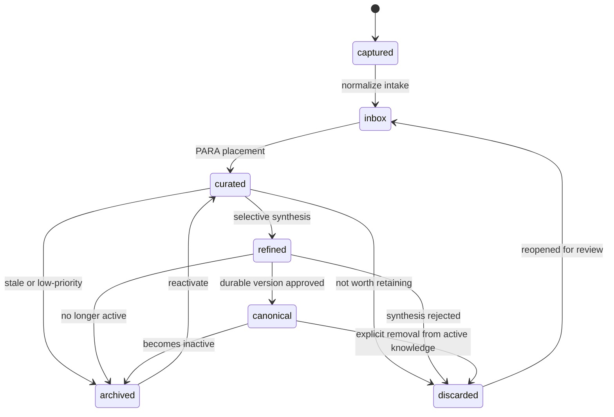

# PARAFFINE Note Lifecycle

## Reference Index

- [README.md](../README.md)
- [AGENTS.md](../AGENTS.md)
- [PARAFFINE architecture](paraffine-architecture.md)
- [Implementation checklist](00-IMPLEMENTATION-CHECKLIST.md)

## Purpose

This spec defines the durable note lifecycle for PARAFFINE. It is the contract that later tasks use for inbox intake, PARA placement, selective refinement, archive review, and agent-facing retrieval.

The model is deliberately documentation-level only. It does not define runtime code, database schema, or scheduler implementation details.

## Design Principles

- Keep one shared PARA model for software, business, and personal material.
- Keep discard auditable; do not treat it as silent deletion.
- Keep capture-time metadata minimal so agents can ingest quickly.
- Add curation-time metadata only when a note has been reviewed.
- Keep deterministic and AI-assisted flows compatible with the same state contract.
- Do not finalize threshold values by inventing precision that the product has not validated.

## Policy Decisions

The following policy decisions are locked for the current implementation phase:

- scoring uses both numeric values and qualitative bands
- all five dimensions are active in the MVP:
  - `confidence`
  - `complexity`
  - `relevance`
  - `duplication`
  - `freshness`
- canonicalization should be aggressive when duplication is high, but only if confidence is not low
- capture-time required fields are:
  - `raw_text`
  - `source`
  - `captured_at`
  - `domain_hint`
  - `kind_hint`
- discarded notes do not re-enter the workflow automatically; they are reopened manually

## State Model

### States

| State | Meaning | Typical Owner |
|-------|---------|---------------|
| `captured` | Raw note or source event exists, but it has not been normalized into the workflow yet. | Agent, CLI, or intake tool |
| `inbox` | The note is stored in the shared intake queue and is waiting for the first curation pass. | Curation loop |
| `curated` | The note has been assigned a PARA destination and review metadata. | Curation loop |
| `refined` | The note has been rewritten or condensed into a cleaner durable form, but it is not yet the canonical version. | Refinement loop |
| `canonical` | The note is the authoritative retained version that agents should prefer for retrieval. | Refinement loop or curator |
| `archived` | The note is retained for historical context but is not active work. | Archive review loop |
| `discarded` | The note was reviewed and intentionally not kept as active knowledge. It remains auditable. | Archive review loop |

### Transition Flow

### Transition Rules

- `captured -> inbox` happens whenever raw material is admitted into PARAFFINE.
- `inbox -> curated` happens after the first routing decision is made.
- `curated -> refined` happens only for notes that justify durable synthesis.
- `refined -> canonical` happens only when the note is stable enough to be reused directly.
- `curated` or `refined` can move to `archived` when they remain useful but are no longer active.
- `curated` or `refined` can move to `discarded` when they are judged not worth keeping.
- `archived` notes can be reactivated if they regain relevance.
- `discarded` notes remain visible in audit history and can be reopened if a later review says they were rejected too aggressively.

## Metadata Contract

### Capture-Time Metadata

Capture-time metadata should stay small and easy to provide.

| Field | Required | Notes |
|-------|----------|-------|
| `captured_at` | Yes | When the note first entered the system |
| `source` | Yes | Agent, CLI, manual entry, or other origin |
| `raw_text` | Yes | The original note content |
| `source_ref` | No | Pointer back to the originating message, file, or prompt |
| `domain_hint` | Yes | Early guess such as software, business, personal, or shared |
| `kind_hint` | Yes | Early guess about PARA destination |

Capture-time data must not require a final PARA destination, a final score, or a final retention decision. `domain_hint` and `kind_hint` are mandatory hints, not final curation outcomes.

### Curation-Time Metadata

Curation-time metadata is added when the note has been reviewed.

| Field | Required | Notes |
|-------|----------|-------|
| `status` | Yes | One of the lifecycle states above |
| `kind` | Yes | PARA destination class such as project, area, resource, or archive |
| `domain` | Yes | The main domain tag used for filtering and retrieval |
| `confidence` | Yes | How trustworthy or settled the note is |
| `complexity` | Yes | How much cleanup or synthesis the note needs |
| `relevance` | Yes | How useful the note is to active work |
| `review_due_at` | Yes | When the next scheduled review should happen |
| `last_reviewed_at` | Yes | When curation last touched the note |
| `retained_reason` | No | Why the note was kept |
| `discard_reason` | No | Why the note was intentionally not kept |
| `canonical_ref` | No | Pointer to the canonical note when this note was merged or superseded |
| `refined_at` | No | When the note became a durable synthesis candidate |
| `archived_at` | No | When the note left active work |
| `discarded_at` | No | When the note was intentionally excluded from active knowledge |

## Scoring And Routing Model

The scoring model is based on a few stable inputs. Each input carries a numeric score and a derived qualitative band.

| Input | What It Measures | Used For |
|-------|------------------|----------|
| `confidence` | How likely the note is correct, useful, or settled | Canonicalization, discard review, and merge confidence |
| `complexity` | How much cleaning or synthesis the note needs | Whether the note deserves a refinement pass |
| `relevance` | How important the note is to current or likely future work | Whether the note stays active or is archived |
| `duplication` | How much the note overlaps with existing canonical knowledge | Merge, dedupe, or supersede decisions |
| `freshness` | How recently the note was created or reviewed | Review cadence and staleness handling |

### Band Thresholds

| Band | Range | Meaning |
|------|-------|---------|
| `low` | `0-39` | Weak signal, low priority, or low trust |
| `medium` | `40-69` | Mixed signal, moderate importance, or moderate certainty |
| `high` | `70-100` | Strong signal, high importance, or high certainty |

These thresholds apply across all five dimensions for the first implementation pass.

### Routing Bands

| Decision Band | Typical Condition | Outcome |
|---------------|-------------------|---------|
| `keep as-is` | Confidence is high and complexity is low | Keep the note in curated form without synthesis |
| `refine candidate` | Complexity is high enough that the note should be cleaned up | Move the note into refinement |
| `canonical candidate` | The note is stable, useful, and not overly duplicated | Promote the note to canonical status |
| `archive candidate` | The note remains useful but is no longer active | Archive the note with an audit trail |
| `discard candidate` | The note is not useful enough to retain as active knowledge | Mark the note as discarded, with reason recorded |

### Decision Rubric

| Outcome | Typical Signal Pattern | Default Decision |
|---------|------------------------|------------------|
| `keep as-is` | `confidence=high`, `complexity=low`, `duplication=low/medium` | Keep in `curated` without refinement |
| `refine` | `complexity=high` and `relevance=medium/high` | Move to `refined` |
| `canonicalize` | `confidence=high`, `relevance=high`, `duplication=low/medium` | Promote to `canonical` |
| `merge/supersede` | `duplication=high` and `confidence=medium/high` | Merge into canonical or supersede duplicate |
| `archive` | `relevance=low`, `freshness=low`, but still useful | Move to `archived` |
| `discard` | `confidence=low`, `relevance=low`, `duplication=high` or clearly not useful | Move to `discarded` |

### Canonicalization Rule

- Prefer aggressive canonicalization to avoid knowledge sprawl.
- Do not aggressively merge uncertain notes into canonical state when `confidence` is low.
- If duplication is high but confidence is low, keep the note non-canonical until later review or discard it if relevance is also low.

## Review Cadence

The cadence below is a default operating model, not a hard runtime guarantee.

| State | Review Cadence | Purpose |
|-------|----------------|---------|
| `inbox` | Next scheduled run or daily | Clear raw captures quickly |
| `curated` | Weekly | Re-check placement and decide whether the note should be refined |
| `refined` | Weekly or after a major source update | Confirm the synthesis still matches the source material |
| `canonical` | Monthly | Keep durable knowledge fresh and merge duplicates if they appear |
| `archived` | Monthly or quarterly | Decide whether stale material should be reactivated or left alone |
| `discarded` | Manual reopen only | Preserve the ability to recover a rejected note if the decision changes |

## Outcome Contracts

### Refinement

Refinement turns a messy note into a cleaner durable knowledge candidate.

Required outputs:

- A normalized title
- A concise summary
- Links or references back to source material
- The current PARA destination
- A recommendation about whether the note should become canonical, stay curated, be archived, or be discarded

Refinement must not erase the original source trail.

### Archive

Archiving preserves a note without making it part of the active knowledge surface.

Required outputs:

- `status = archived`
- A recorded archive reason
- A retained audit trail
- A review date for possible reactivation

Archived notes should remain retrievable, but they should not compete with canonical material in default agent-facing views.

### Discard

Discarding is a deliberate decision, not a deletion shortcut.

Required outputs:

- `status = discarded`
- A recorded discard reason
- An audit trail that shows the note was reviewed
- A reopen path if the decision later proves too aggressive

Discarded notes should be excluded from default retrieval and active review loops, but they must remain visible in the history of decisions.

## Deterministic And AI-Assisted Compatibility

PARAFFINE must support both deterministic and AI-assisted curation without changing the lifecycle contract.

- Deterministic mode uses explicit rules, metadata, and scheduler logic only.
- AI-assisted mode may suggest scores, summarize notes, or recommend a destination.
- Both modes must emit the same state values and metadata fields.
- AI must not invent lifecycle states or bypass the audit trail for archive and discard.
- If AI is unavailable, the workflow still needs to support capture, curation, archiving, and retrieval through deterministic rules.

## Implementation Defaults

The following implementation defaults are now locked for the MVP so downstream tasks do not need to reopen them.

### Score Persistence

- Persist both the raw numeric score and the derived qualitative band for each dimension.
- Treat the numeric score as the source of truth.
- Recompute and overwrite the stored band whenever the numeric score changes.
- Expose bands directly to agent retrieval surfaces so filtering and review logic do not need to re-derive them at read time.

### Scoring Pipeline

- Use a hybrid scoring pipeline for the MVP.
- Deterministic rules provide the baseline score for every dimension so the system works without AI.
- AI-assisted refinement may suggest score adjustments, summaries, dedupe recommendations, and canonicalization candidates.
- Final emitted scores must still conform to the same numeric-plus-band contract, regardless of whether AI participated.
- If AI is unavailable, the workflow falls back to deterministic scoring without changing state transitions or payload shape.

### Retrieval Payload Contract

Canonical notes and curated notes do not expose the same default payload. Retrieval should prefer canonical notes whenever they exist.

| Retrieval Class | Minimum Payload |
|-----------------|-----------------|
| `canonical` | `id`, `title`, `status`, `kind`, `domain`, `summary`, `canonical_body`, `source_refs`, `confidence`, `confidence_band`, `relevance`, `relevance_band`, `last_reviewed_at`, `canonical_ref` if superseded lineage exists |
| `curated` | `id`, `title`, `status`, `kind`, `domain`, `summary_or_excerpt`, `confidence_band`, `complexity_band`, `relevance_band`, `last_reviewed_at`, `review_due_at`, `canonical_ref` if a canonical note already exists |

Default retrieval behavior:

- return `canonical` notes first when both canonical and curated variants exist
- return `curated` notes when no canonical note exists or when the caller explicitly requests working material
- exclude `discarded` notes from default retrieval
- keep `archived` notes out of default retrieval unless the caller requests historical context
